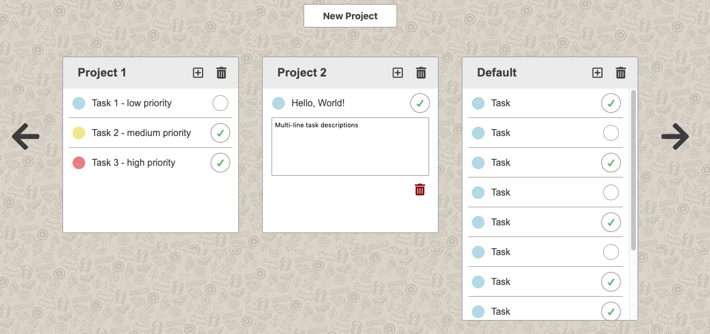

# JavaScript project: To-do List

## Core Functionalities
- Allows create and delete projects
- Allows create, remove, and update tasks in a project
- Allows horizontal navigation when many projects
- Allows vertical navigation when many tasks
- Stores data into local storage



Authors: <a href="https://github.com/btuerker">Burhan Tuerker</a> / <a href="https://github.com/madcido">Fabio Carmo</a>

Live Preview: https://raw.githack.com/btuerker/js-todo/master/dist/index.html

## Installation Guide
### Prerequisities
System dependencies:
```
$ node -v
  v10.15.3

$ npm -v
  6.4.1

$ webpack -v
  4.34.0
```

#### Local setup
##### Clone project
```
$ git clone https://github.com/btuerker/js-todo.git
$ cd ./js-todo
```
##### Install dependencies
```
$ npm install
```
##### Build project
```
$ npm run build
```

Now you can check the dist/index.html file with your best browser.
